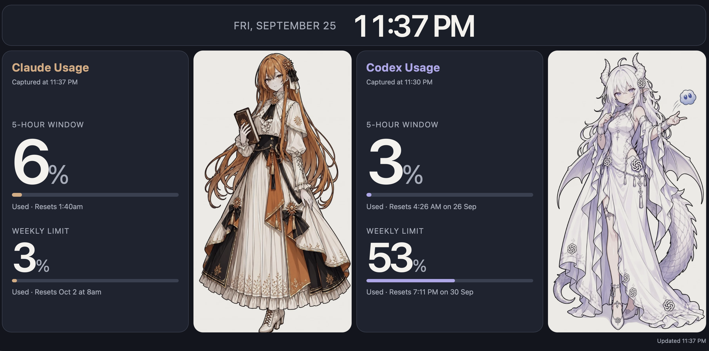

# TokenWatch

A small dashboard that shows your **Claude** and **Codex** subscription usage (the 5-hour window and weekly limit) on a device on your local network, such as an old tablet or spare phone.

It started as a "just for fun" project. It is not meant to be a product.

## ShowCase



## How it works

```
Mac (with Claude Code / Codex signed in)                  Tablet
─────────────────────────────────────────────            ──────
scrape.py, every 5 min by default:                        browser, every 60 s:
  • opens `claude` in a tmux session, types /usage          GET http://<mac-ip>:7777/usage.json
  • opens `codex` in a tmux session, types /status          renders the dashboard
  • reads the percentages off the screen
  • writes public/usage.json
python3 -m http.server  ──── serves public/ on :7777 ────▶
```

- The Mac does all the collecting. The tablet is a pure display and holds no credentials.
- Each check starts a **fresh** CLI session and closes it afterwards, because an already-open usage panel does not refresh.
- Claude reports usage as "% used", Codex as "% left". The scraper converts Codex to "% used" so both sides read the same way.
- If a check fails, the last good numbers remain on screen and the page shows a warning. Details are available in the scraper output.

## Why read the CLI output

tokenwatch **does not read credential files or call service APIs directly**. It types `/usage` or `/status` into the installed CLIs and parses what they display, much as you would check the usage screens yourself.

This approach is fragile: a change to either CLI's usage screen can break the parser. Keep the check interval modest (the default is five minutes).

## Requirements

- macOS or Linux
- Python 3.7+ (standard library only)
- tmux: `brew install tmux` (macOS) or `sudo apt install tmux` (Debian/Ubuntu)
- Claude Code and/or Codex installed and logged in
- A device with a browser on the same network

## Setup

```bash
# 1. Go to the project directory and create a working directory for the CLIs
cd /path/to/tokenwatch
mkdir -p probe
cd probe

# 2. Run the CLIs you plan to monitor, accept any trust prompts, then exit each one
claude  # skip if you do not use Claude Code
codex   # skip if you do not use Codex

# 3. Test one scrape
cd ..
python3 scrape.py --once

# 4. Start the server + scraper
bash run.sh
```

`run.sh` prints the address to open on the tablet, such as `http://192.168.1.20:7777`. If it cannot detect your Mac's IP address, enter the address manually.

The scraper saves the most recent captured CLI screens in `probe/last_claude.txt` and `probe/last_codex.txt` for troubleshooting.

## Run at boot on Linux (systemd)

`tokenwatch.service` is a systemd user unit. It assumes the project lives at `~/github/tokenwatch`; edit the paths in the file if it does not.

```bash
mkdir -p ~/.config/systemd/user
ln -sf ~/github/tokenwatch/tokenwatch.service ~/.config/systemd/user/
systemctl --user daemon-reload
systemctl --user enable --now tokenwatch

# Start at boot even when nobody is logged in
sudo loginctl enable-linger "$USER"
```

Check it with `systemctl --user status tokenwatch` and follow the logs with `journalctl --user -u tokenwatch -f`. If a firewall is enabled, open the port, for example `sudo ufw allow 7777/tcp`.

## Project layout

```
tokenwatch/
├── README.md           # this file
├── tokenwatch.service  # systemd user unit for running at boot on Linux
├── run.sh              # starts the static server and the scraper; Ctrl+C stops both
├── scrape.py           # drives the CLIs in tmux and writes public/usage.json
├── probe/              # working directory for the CLIs and captured screens
└── public/             # the ONLY directory served over the network
    ├── index.html      # the dashboard
    ├── usage.json      # written by scrape.py
    └── image/
        ├── Claude.png
        └── Codex.png
```

## Configuration

Environment variables for `scrape.py`:

| Variable       | Default        | Meaning                                        |
| -------------- | -------------- | ---------------------------------------------- |
| `TW_INTERVAL`  | `300`          | Seconds between checks                         |
| `TW_BOOT_WAIT` | `8`            | Seconds to wait after launching a CLI          |
| `TW_TOOLS`     | `claude,codex` | Which tools to check; missing CLIs are skipped |

For `run.sh`: `TW_PORT` (default `7777`).

On the page, colors are defined by the `:root` CSS variables in `index.html`. The warning thresholds are in `metric()` (60% turns yellow; 85% turns red).

## Images

The two image columns load `public/image/Claude.png` and `public/image/Codex.png`. You can replace those files with images you have permission to use. If either image is missing or cannot load, its column hides automatically.

## Security notes

- Only `public/` is served. Do not start the server from your home directory.
- The server has no authentication. Anyone who can reach your Mac on the local network can view the dashboard and files in `public/`, including the images and `usage.json`. Use it only on a trusted network.
- Do not publish `public/usage.json` or `probe/last_*.txt`; they contain your usage data and captured CLI output.
- Never expose the port to the internet.

## Known limitations

- **The Mac must be awake.** `caffeinate -i` prevents idle sleep while `run.sh` is running, but closing the lid still stops everything. The page shows a warning when the data goes stale.
- **Claude's numbers come from its CLI usage screen.** Depending on your plan, they may also reflect usage in other Claude apps.
- **Codex may need a prior message.** Depending on the Codex version, `/status` in a brand-new session may not show rate-limit data yet. Check by opening a new `codex` session and typing `/status` right away.
- **UI changes break parsing.** If a check fails, look at `probe/last_*.txt` and adjust the regexes in `parse_claude()` / `parse_codex()`.

## Credits

Inspired by [token-monitor-RLCD](https://github.com/CEJXXX/token-monitor-RLCD), which puts the same idea on an ESP32 e-paper-style display. tokenwatch takes a different route for the data source (screen-scraping the official CLIs instead of calling the API) and uses a tablet instead of dedicated hardware.

Not affiliated with Anthropic or OpenAI.
